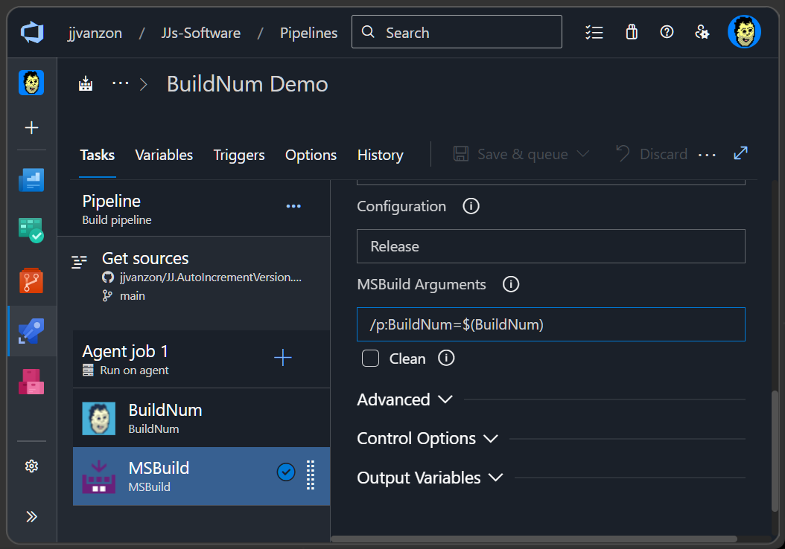

BuildNum
========

__Azure Pipelines__ task that:

- Finds `BuildNum.xml`
- Reads the `BuildNum` element
- Stores it in the `$(BuildNum)` variable

It has no parameters, only the output `$(BuildNum)` variable, so you can just drop it in and use it.  
Intended for use with the [`JJ.AutoIncrementVersion`](https://www.nuget.org/packages/JJ.AutoIncrementVersion) nuget package for auto-incremental version numbers in __.NET__.  

Goal
----

You could use `$(BuildNum)` at your own whim.

But the main thing this Task solves, is to keep `$(BuildNum)` constant during the solution build. `MSBuild` might start incrementing `BuildNum` multiple times, as multiple projects build one by one or even in parallel. 

By passing `$(BuildNum)` to the `MSBuild Task` you can mitigate the problem. Fill this out under `MSBuild Arguments:`

```
/p:BuildNum=$(BuildNum)
```

This prevents the build from incrementing `BuildNum` multiple times.



Alternative
-----------

If you need something more specific, I the [Set variable with value from XML](https://marketplace.visualstudio.com/items?itemName=YodLabs.VariableTasks) task by [Yod Labs](https://marketplace.visualstudio.com/publishers/YodLabs). Using these parameters accomplishes something similar:


```
Variable Name    : BuildNum
XPath expression : //BuildNum
XML file path    : BuildNum.xml
```

`Set variable with value from XML` might not recursively search for the `BuildNum.xml` but uses a literal path. `BuildNum` searches recursively and has no parameterization burden, working out of the box with the [`JJ.AutoIncrementVersion`](https://www.nuget.org/packages/JJ.AutoIncrementVersion) nuget package.